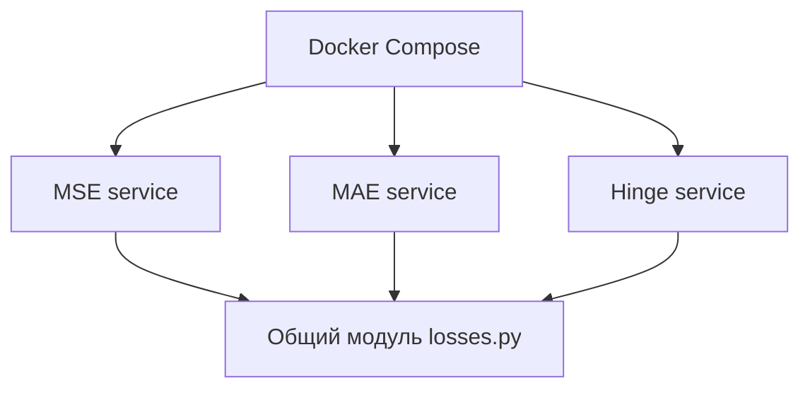

# Контейнеризированный набор сервисов для вычисления функций потерь

## Кратко
Небольшой технический репозиторий, показывающий контейнеризацию независимых Python-сервисов для расчёта MSE, MAE и squared hinge loss через Docker Compose.

## Задача
Показать базовый паттерн разбиения вычислительной логики на независимые контейнеры с общим окружением и воспроизводимым запуском.

## Архитектура


## Что показать в README
- какие функции потерь реализованы;
- как организован запуск по контейнерам;
- что код воспроизводимо поднимается в одинаковом окружении.

## Запуск
```bash
docker compose up --build
```
